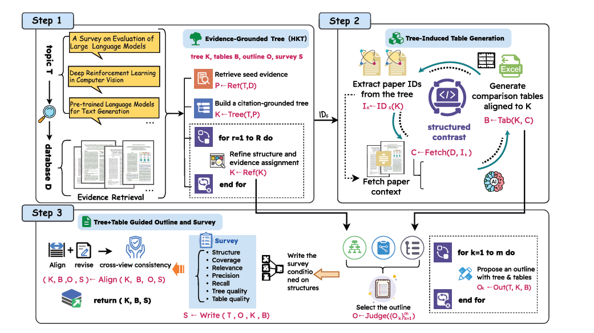
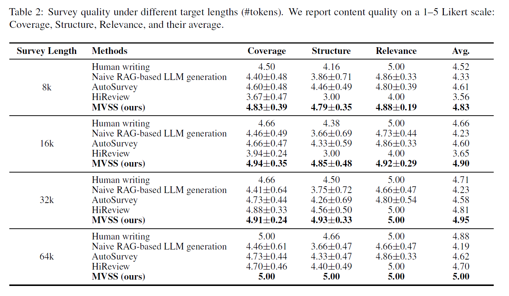

# MVSS (ACL Submission)

  <a href="https://arxiv.org/abs/XXXX.XXXXX">MVSS: A Unified Framework for Multi-View Structured Survey Generation</a>

## Introduction

MVSS is a **structure-first** framework for automated literature survey generation. It produces **three mutually aligned views** of a research domain:

1) a hierarchical knowledge tree (HKT)  
2) tree-induced comparison tables  
3) a textual survey explicitly conditioned on both structures

---

## Requirements

- Python 3.10.x
- Required Python packages listed in `requirements.txt`
- CUDA GPU recommended

---

## Installation

(Recommended) create an environment and install dependencies:

    cd MVSS
    conda create -n mvss python=3.10 -y
    conda activate mvss
    pip install -r requirements.txt

---

## Download the Database (from AutoSurvey)

Download the database provided by AutoSurvey (CS category, ~530k paper abstracts) from:
https://1drv.ms/u/c/8761b6d10f143944/EaqWZ4_YMLJIjGsEB_qtoHsBoExJ8bdppyBc1uxgijfZBw?e=2EIzti

Unzip it to `./database/`:

    unzip database.zip -d ./database/

Expected database layout:

    ./database/
      arxiv_paper_db.json
      faiss_paper_title_embeddings.bin
      faiss_paper_abs_embeddings.bin
      arxivid_to_index_abs.json

Note: the database is typically large and environment-dependent. We recommend NOT committing it to GitHub.

---

## Usage

OpenAI API key. Use an environment variable (recommended):

    export OPENAI_API_KEY="sk-xxxxxx"

All example commands below use the official OpenAI-compatible endpoint:
https://api.openai.com/v1/chat/completions

---

## Three-Step Pipeline (Tree → Tables → Survey)

MVSS follows the three-phase workflow in the paper:

Step 1) Evidence-Grounded Tree (HKT)  
Step 2) Tree-Induced Table Generation  
Step 3) Tree+Table Guided Outline and Survey Writing

Important implementation note:
Step 2 is presented as an independent phase in the paper, but in this repo it is executed automatically when running Step 3 (`main.py`).
That is, Step 3 will first generate tables from the tree, then generate outline and survey text conditioned on both structures.

---

## Step 1 — Generate Trees (HKT)

Tree generation lives under `tree_generation/`.

Prepare a topic list file (one topic per line), e.g. `testtxt.txt`:

    LLMs for education
    Diffusion models
    Graph neural networks

Run tree generation:

    cd tree_generation

    python tree_generation.py \
      --topic_txt ../testtxt.txt \
      --gpu 0 \
      --saving_path ./output/cal/ \
      --model gpt-4o \
      --db_path ../database \
      --embedding_model nomic-ai/nomic-embed-text-v1 \
      --api_url https://api.openai.com/v1/chat/completions \
      --api_key $OPENAI_API_KEY

Tree generation outputs (under `tree_generation/output/...`) include:
- `*_tree.json` / `*_tree.md`: generated trees
- `*_scores.json`: built-in evaluation scores + citation recall/precision

A typical output layout looks like:

    tree_generation/output/cal/
      per_iter/
        TOPIC_iter00_tree.md
        TOPIC_iter00_tree.json
        TOPIC_iter00_scores.json
        ...
        TOPIC_all_iters_scores.json
      without_re/
        TOPIC_tree.md
        TOPIC_tree.json
        TOPIC_scores.json
      with_re/
        TOPIC_tree.md
        TOPIC_tree.json
        TOPIC_scores.json

Recommended: use `with_re/` as the refined tree set for the next steps.

---

## Step 2 — Generate Comparison Tables

This step generates tree-aligned comparison tables.

In this repo, there is no standalone CLI entry for Step 2.
Instead, Step 2 is triggered automatically at the beginning of Step 3 (`main.py`):

- Input: the refined tree (`*_tree.json` + `*_tree.md`)
- Output: comparison tables that are embedded into the final survey markdown (`TOPIC.md`) as Markdown tables

So you can treat Step 2 as a standalone phase conceptually, and then inspect the generated tables in the Step 3 outputs.

---

## Step 3 — Generate Survey

Run survey generation in the project root.
This step will execute Step 2 first (table generation), then generate outline and survey text.

Example command (topic: "LLMs for education"):

    cd ..

    python main.py \
      --topic "LLMs for education" \
      --gpu 0 \
      --saving_path ./survey-output/ \
      --tree_dir ./tree_generation/output/cal/with_re/ \
      --model gpt-5.2 \
      --db_path ./database \
      --embedding_model nomic-ai/nomic-embed-text-v1 \
      --embedding_model nomic-ai/nomic-embed-text-v1 \
      --api_url https://api.openai.com/v1/chat/completions \
      --api_key $OPENAI_API_KEY

Outputs saved in `--saving_path`:
- `TOPIC.md` (final survey markdown, including the generated tables)
- `TOPIC.json` (survey text + reference map)

---

## Survey Evaluation

Evaluate generated surveys under a folder:

    python survey_evaluate.py \
      --saving_path ./survey-output/ \
      --model gpt-5.2 \
      --api_url https://api.openai.com/v1/chat/completions \
      --api_key $OPENAI_API_KEY \
      --db_path ./database \
      --embedding_model nomic-ai/nomic-embed-text-v1

Evaluation outputs (written into `--saving_path`):
- `TOPIC_evaluation.txt`
- `evaluation_summary.jsonl` (append-only)

---

## Notes

- If you run `tree_generation.py` inside `tree_generation/` and your database is at repo root, use `--db_path ../database`.

---

